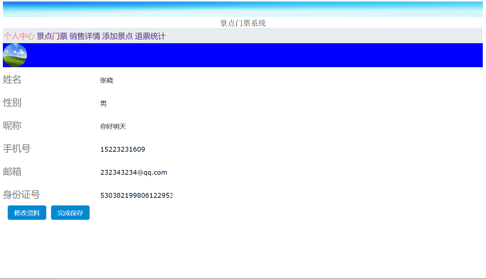
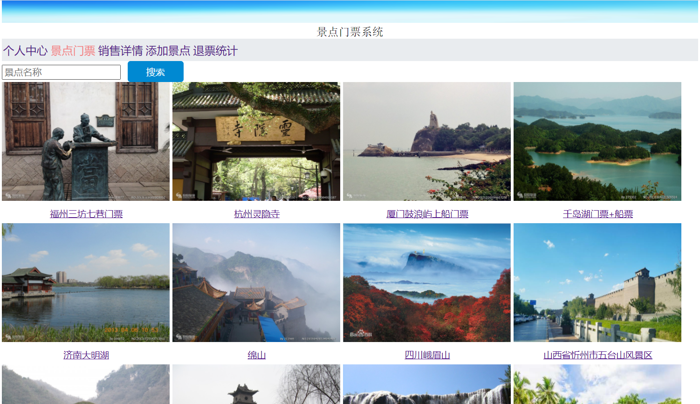
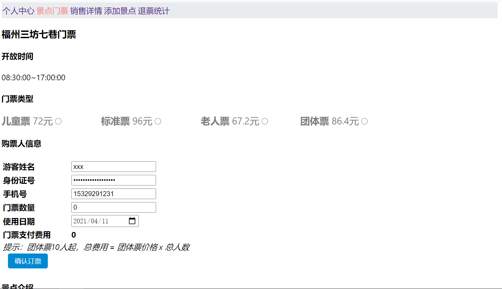
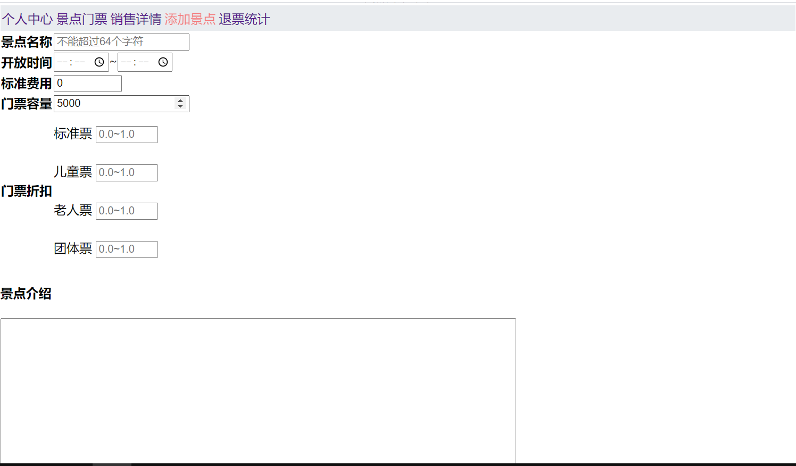
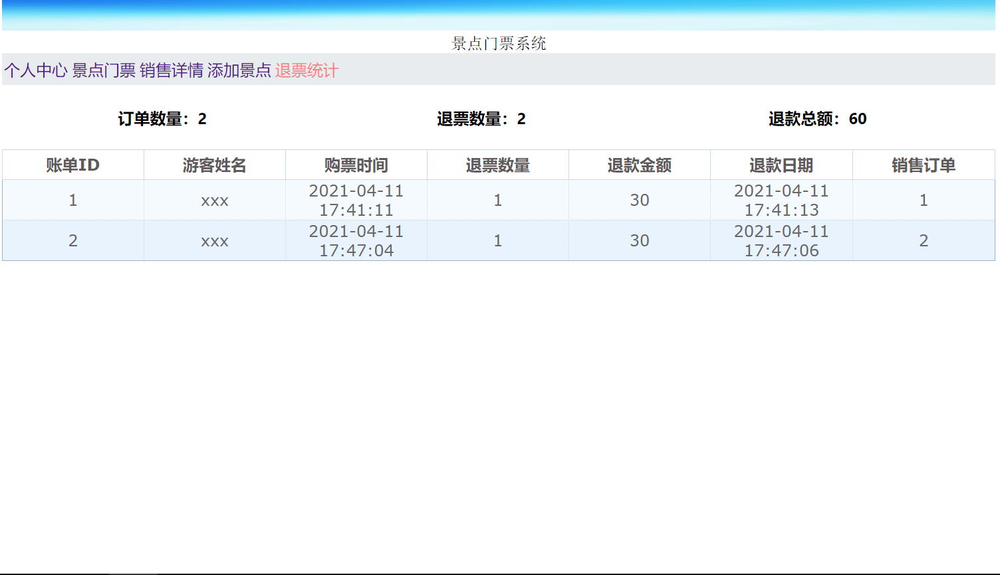

# scenicticket-ui项目
## 项目简介

- 该项目是本人初学React时用官方脚手架构建和独立设计的项目
- 项目主要对景点信息进行查询，预定门票，查询订票记录，退订门票，目前所设计的UI界面仅面向营业员，如有需要完善游客UI界面，还需要进行完善

## 项目要点

- 页面构建交替使用了函数式组件和类组件，展示了`React`组件的状态更新，不同组件之间数据传递，以及父子组件通过回调函数更新组件
- 在函数式组件中主要使用了`useState,useEffect,useCallback, useRef, useContext`
- 使用`react-router-dom`路由组件实现组件之间数据的传递，以及组件之间跳转
- 配置`axios`全局的拦截器，用于统一管理所有请求的`URL`前缀，以及进行错误处理

## 项目创建

*参考文档：*[Create React App](https://github.com/facebook/create-react-app).

```shell
#创建react项目参考命令
#如果没有全局官方安装脚手架，则需要先安装
npm install create-react-app -g
#创建基于typescript的react项目react-ts-app
#注意这里是用npx而不是npm
npx create-react-app react-ts-app --template typescript
#创建好以后切换到项目根目录
cd react-ts-app
#启动项目
yarn start
```


## 页面展示













## 脚本命令 

这些命令在用脚手架创建项目后会自动提示，在项目根目录可以执行以下命令

### `yarn start`

启动项目开发环境，启动后在浏览器访问 [http://localhost:3000](http://localhost:3000)

### `yarn test`

在交互式监视模式下启动测试运行程序，有关更多信息，请参见关于[运行测试]（https://facebook.github.io/create-react-app/docs/running-tests）的部分

### `yarn build`

将要生产的应用程序构建到“ build”文件夹中。它在生产模式下正确捆绑了React，并优化了构建以获得最佳性能。

生成被最小化，并且文件名包含哈希值。您的应用已准备好进行部署！

有关更多信息，请参见关于[deployment]（https://facebook.github.io/create-react-app/docs/deployment

### `yarn eject`

**注意：这是单向操作。一旦执行，就无法返回！**

如果您对构建工具和配置选择不满意，则可以随时“弹出”。此命令将从您的项目中删除单个生成依赖项。

它将所有配置文件和传递依赖项（webpack，Babel，ESLint等）直接复制到您的项目中，因此您可以完全控制它们。除了`eject`以外的所有命令仍然可以使用，但是它们将指向复制的脚本，因此您可以对其进行调整。至此，您就可以依靠自己了。

您不必使用`eject`。精选功能集适用于中小型部署，您不应该使用此功能。但是，我们了解到，如果在准备就绪时无法自定义该工具，它将不会有用。

## React App文档

创建React App： [Create React App documentation](https://facebook.github.io/create-react-app/docs/getting-started).

React文档： [React documentation](https://reactjs.org/).
